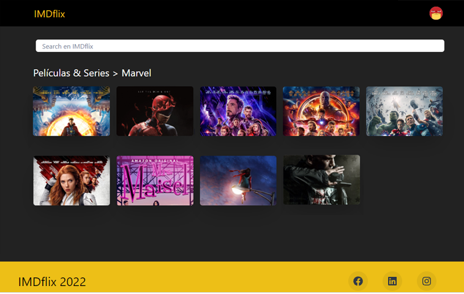

# Challenge JS - React - Search IMDflix




Objetivo: Crear una aplicación para buscar películas o series por su título utilizando la API de IMDB.
La aplicación debe contar con una pantalla con un input para realizar la búsqueda y 1 a 3
filas mostrando los thumbnails de los resultados. Al hacer hover o click sobre el thumbnail
deberá mostrarse más información (título/descripción) de la película/serie.


## Corriendo el proyecto
```bash
# Instalar dependencias del proyecto
npm install
```

## Tecnologias
```bash
# Node.js, React, Chakra-Ui, Css, Api, Fetch
```